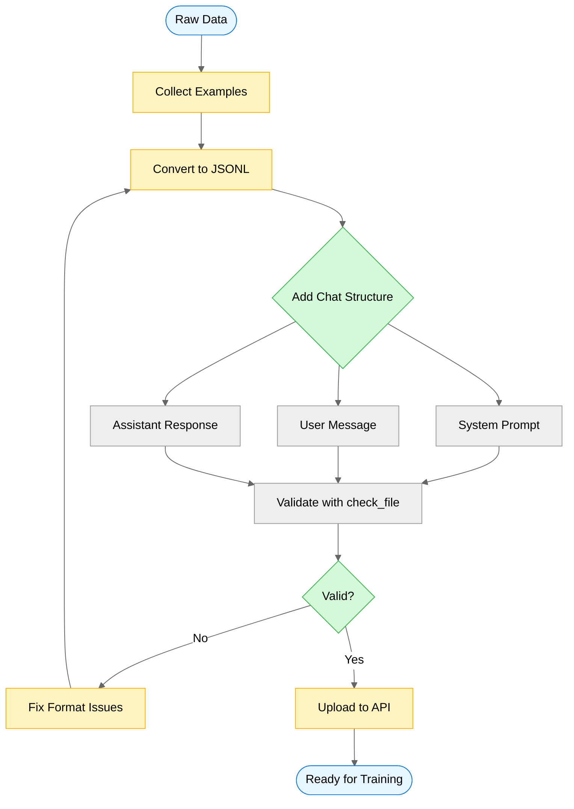
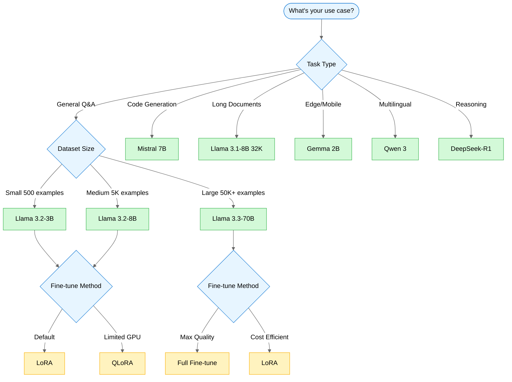

## The $47 Typo That Changed Everything

I ran a debugging session last month that cost me $47. The culprit? A single-character typo in a configuration file. My AI agent—powered by a massive 70B parameter model—churned through thousands of tokens just to find it.

That's when I started asking: what if I could teach a smaller, cheaper model to be really good at my specific tasks? Turns out, I could. And the journey taught me something counterintuitive: **a fine-tuned 3B model often beats a prompted 70B model while costing 8x less to run.**

This is the story of how I discovered fine-tuning APIs—specifically Together.ai's platform and the new Tinker API from Mira Murati's company, Thinking Machines Lab.

## What Actually Is Fine-Tuning? (And Why Should You Care?)

Before I dove into the APIs, I had to wrap my head around what fine-tuning really means. Think of it this way: you wouldn't train a doctor from scratch to become a cardiologist—you'd take someone who already knows medicine and specialize them.

Fine-tuning is exactly that. You take a pre-trained language model (one that already understands language, reasoning, and general knowledge) and teach it new, specific behaviors by training it on a smaller, task-specific dataset.

Here's what surprised me: there are actually **two different products** both called "Tinker API":

1. **Together.ai's Fine-Tuning API** — A mature platform supporting 100+ open source models with LoRA and full fine-tuning
2. **Thinking Machines Lab's Tinker API** — A brand-new infrastructure-abstracted API launched in October 2024, offering granular training control

I'm focusing primarily on Together.ai here because it's more production-ready and has better documentation. But I'll touch on when you might want the lower-level control of Thinking Machines' Tinker.

## Why I Even Bothered Learning This

Remember when customizing an LLM meant renting expensive GPU clusters for $10,000/month? I talked to a startup last year that wanted to build a simple FAQ bot for their product docs. They estimated a **3-month engineering project** just to set up the training infrastructure.

That's insane.

Fine-tuning APIs changed the game. With Together.ai, I learned I could:
- Upload a JSONL file with 500 examples
- Call an API endpoint
- Get a fine-tuned model deployed to serverless inference in hours

No GPU cluster. No distributed training code. No infrastructure nightmares.

The business case clicked for me when I saw the numbers: **a fine-tuned Llama 3.1-8B can outperform the 70B base model by 10% on domain-specific tasks** while costing 8x less to run. Small, specialized models beat large general ones. Every time.

## The Five Principles I Wish I'd Known Earlier

### Principle 1: LoRA Changed Everything (And I Didn't Realize It at First)

I started my fine-tuning journey thinking I had to update all the model's parameters. You know, billions of weights that require massive GPU memory and storage. I was wrong.

Enter LoRA (Low-Rank Adaptation). When I first read about it, I didn't get why it mattered. Then I tried to fine-tune Mistral 7B the traditional way and hit an out-of-memory error on my 40GB GPU. Oops.

**Here's how LoRA actually works**: Instead of updating a weight matrix W directly, LoRA decomposes the update into two small matrices: W + BA, where B and A have much lower rank. For a 7B model, this means training **0.19% of parameters instead of 100%**.

Let me give you the numbers that made this real for me:

**Memory savings that shocked me**: Fine-tuning Mistral 7B traditionally requires 40GB+ VRAM. With QLoRA (LoRA + 4-bit quantization), I did it on my friend's RTX 2080 Ti with just 11GB VRAM. The checkpoint went from 14GB to a few megabytes.

**Speed improvements I didn't expect**: Philipp Schmid from Hugging Face reports QLoRA achieves 18-minute training versus 360 minutes for full fine-tuning on 8x L4 GPUs. That's a **20x speedup**. When I first saw these numbers, I thought there had to be a catch. There wasn't.

**The flexibility I love**: With Multi-LoRA, you can train separate adapters for different tasks (summarization, Q&A, code generation) and swap them at inference time. Together.ai supports this natively—upload multiple adapters and switch between them via API parameter. I use this for different writing styles.

**The production trade-off I learned the hard way**: LoRA models get immediate serverless inference on Together.ai. Full fine-tuned models require dedicated endpoints. For most use cases, LoRA is the right choice. I only learned this after setting up a dedicated endpoint I didn't need.


### Principle 2: I Wasted Money on Bad Data (Until I Learned This)

Here's the counterintuitive truth that cost me real dollars to learn: **500 high-quality examples often outperform 50,000 noisy ones**.

I made this mistake early. I thought "more data = better model" and dumped 10,000 training examples into my first fine-tuning job. The model learned... inconsistency. It picked up on formatting variations, contradictory examples, and edge cases I hadn't noticed.

What makes data "high quality"? I learned the hard way:

- **Consistent formatting** — Same prompt template throughout (I had three different formats in my first dataset)
- **Clear input-output relationships** — No ambiguity about what the model should learn
- **Representative of production** — My training data had examples I'd never actually see in production
- **Free of contradictions** — I had two examples that gave opposite answers to the same question

**The formatting trap that got me**: Mistral AI's documentation warns that "slight misspecification in prompts significantly impacts fine-tuned performance." My training data used `### Question:` but my production code used `Question:` (no hash marks). The model underperformed for two weeks before I caught it.

**The format that actually works** (Together.ai requires this):

```json
{"messages": [
  {"role": "system", "content": "You are a helpful legal assistant."},
  {"role": "user", "content": "What is breach of contract?"},
  {"role": "assistant", "content": "A breach of contract occurs when..."}
]}
```

**The validation step I should have done first**: Together.ai provides a `check_file()` function that validates your data before upload. I only discovered this after wasting $23 on a training run with malformed JSON. Use it. Trust me.

**The results that made me a believer**: The Together Cookbook demonstrates training on a curated dataset improved Exact Match from 0.01 to 0.31 and F1 from 0.18 to 0.41—a **30x improvement** from quality data. When I cleaned up my own dataset and reduced it from 10,000 examples to 800 high-quality ones, my model got noticeably better.



### Principle 3: Choosing the Wrong Model Costs You Real Money

With 100+ open source models available on Together.ai, I initially just picked the biggest Llama model I could find. Wrong move. The right model depends on your task complexity, latency requirements, and budget.

Here's what I learned after trying (and paying for) several wrong choices:

| Family | Best For | What I Use It For |
|--------|----------|-------------------|
| **Llama 3.3** | General purpose, strong reasoning | My default for most tasks |
| **Qwen 3** | Multilingual, long context | When I need to handle documents in multiple languages |
| **Mistral** | Efficient inference, coding | Code generation for my internal tools |
| **DeepSeek-R1** | Math, reasoning chains | Complex analytical tasks (still experimenting) |
| **Gemma 3** | Lightweight, mobile deployment | Haven't needed this yet, but good to know |

Let me share the specific decisions I made:

**For my FAQ bot**: I went with Llama 3.2-3B fine-tuned with LoRA. It's fast (low latency), cheap to run, and 3B parameters is enough for pattern matching on my specific domain. I initially tried the 8B model—overkill and cost me 2x more per query.

**For summarizing legal documents**: Llama 3.1-8B with 32K context handles long contracts without choking. Together.ai supports context lengths up to 131K tokens for specialized use cases, but I found 32K was the sweet spot for my needs.

**For internal code generation**: Mistral 7B excels at code tasks. I fine-tuned it on my codebase's patterns and now have an internal copilot that understands my team's conventions. This one actually saved me hours of work.

**For edge deployment** (I haven't tried this yet): Gemma 2B can run on mobile devices. If I ever need offline use cases where latency and privacy matter more than raw capability, this is my pick.



### Principle 4: I Almost Skipped RAG (Don't Make My Mistake)

When I first heard about fine-tuning, I thought: "This is the answer to everything!" I was ready to fine-tune models for tasks that didn't need it.

Then I learned about the ladder of customization. There are four rungs, and you shouldn't skip to fine-tuning without trying the simpler approaches first:

1. **Prompting** — Zero investment. Just craft better prompts with few-shot examples.
2. **RAG (Retrieval-Augmented Generation)** — Add a knowledge base. Model retrieves relevant context at runtime.
3. **LoRA Fine-Tuning** — Train behavior patterns. The model learns *how* to respond, not *what* to know.
4. **Full Fine-Tuning** — Maximum customization. Rarely needed outside research.

**When I should have just used better prompting**: I was about to fine-tune a summarization model. Then I tried few-shot prompting with 3-5 example summaries in my desired style first. It worked. Saved me time and money.

**When RAG was the right answer**: I needed a legal assistant that references current statutes. Laws change frequently—fine-tuning would mean retraining every time there's an update. RAG retrieves relevant laws at query time. Problem solved.

**When fine-tuning made sense**: My company requires summaries in a specific bullet-point format with particular headers. I tried prompting for weeks—inconsistent results. Fine-tuning taught the model the structure in a way prompting never could.

**The hybrid approach I use now**: Fine-tune for behavior (how to summarize) + RAG for knowledge (what to reference). This is the production pattern I see in most enterprise deployments, and it's what I've settled on for my most important use cases.

### Principle 5: I Ignored Evaluation and Paid the Price

My first fine-tuned model had a training loss of 0.01. Amazing, right? Wrong. The model hallucinated facts left and right. Training loss going down doesn't mean your model is better—it just means it's better at predicting the training data.

Here's the evaluation hierarchy I learned to use:

| Level | Metrics | When I Use Them |
|-------|---------|-----------------|
| **Basic** | Training loss, perplexity | During training only (sanity check) |
| **Task-specific** | Exact Match, F1, BLEU, pass@k | Before I even think about deployment |
| **Human evaluation** | Preference ranking, factuality checks | For production readiness |
| **Production monitoring** | Latency, error rates, user feedback | After deployment (ongoing) |

**The loss trap I fell into**: My training loss was 0.01 (great!), but the model hallucinated facts. Loss measures prediction accuracy, not truthfulness. I learned to look beyond loss.

**The task metrics that matter**: For my code generation model, I use pass@k (does the code actually run?). For summarization, I use ROUGE and BERTScore. For Q&A, I use Exact Match and F1. Pick metrics that match your actual goals.

**The A/B test that taught me humility**: I deployed my "perfect" fine-tuned model to 10% of traffic. User satisfaction scores were... the same as the baseline. I had optimized for the wrong thing. Back to the drawing board.

**The evaluation pattern I use now**: The Together.ai Cookbook demonstrates evaluating fine-tuned models with multiple metrics (EM, F1) and comparing against baselines before deployment. I do this religiously now. If you're not comparing to a baseline, you're flying blind.

## How It Actually Works in Practice

Let me walk you through the actual workflow I use with Together.ai. This is the real code I run, with the real mistakes I made along the way.

```mermaid
%%{init: {'theme': 'neutral'}}%%
flowchart LR
    subgraph Prepare["1. Prepare"]
        Data[Training Data] --> JSONL[Convert to JSONL]
        JSONL --> Validate[Validate Format]
    end

    subgraph Upload["2. Upload"]
        Validate --> CheckFile[check_file API]
        CheckFile --> UploadFile[files.upload API]
    end

    subgraph Train["3. Train"]
        UploadFile --> CreateJob[fine_tuning.create]
        CreateJob --> Config[Configure LoRA/Epochs/LR]
        Config --> Monitor[Monitor via W&B]
    end

    subgraph Deploy["4. Deploy"]
        Monitor --> Complete{Complete?}
        Complete -->|Yes| Serverless[Serverless Inference]
        Complete -->|Yes| Dedicated[Dedicated Endpoint]
        Serverless --> Inference([Production Ready])
        Dedicated --> Inference
    end

    classDef prep fill:#e7f5ff,stroke:#1c7ed6
    classDef api fill:#fff3bf,stroke:#fab005
    classDef train fill:#d3f9d8,stroke:#37b24d
    classDef deploy fill:#f3d9fa,stroke:#ae3ec9

    class Data,JSONL,Validate prep
    class CheckFile,UploadFile api
    class CreateJob,Config,Monitor train
    class Complete,Serverless,Dedicated,Inference deploy
```



### Step 1: Prepare Your Data (The Part I Got Wrong First)

```python
import json

# Transform your data to JSONL chat format
training_data = []
for example in your_examples:
    training_data.append({
        "messages": [
            {"role": "system", "content": "You are a helpful assistant."},
            {"role": "user", "content": example["question"]},
            {"role": "assistant", "content": example["answer"]}
        ]
    })

# Write to JSONL (not regular JSON!)
with open("training.jsonl", "w") as f:
    for item in training_data:
        f.write(json.dumps(item) + "\n")
```

**My mistake**: I initially wrote regular JSON (with brackets and commas). JSONL is different—each line is a separate JSON object. I only caught this when validation failed.

### Step 2: Validate and Upload (Use check_file, Trust Me)

```python
from together import Together

client = Together()

# Validate file format (DO THIS)
response = client.files.check(file="training.jsonl")
if response.valid:
    # Upload file
    file = client.files.upload(file="training.jsonl")
    print(f"Uploaded: {file.id}")
else:
    # Fix your data!
    print("Validation failed:", response.errors)
```

**What I learned**: The `check_file()` step catches encoding issues, structural problems, and format errors. It's saved me hours of debugging and wasted training budget.

### Step 3: Start Fine-Tuning (With Sensible Defaults)

```python
# Create fine-tuning job
job = client.fine_tuning.create(
    training_file=file.id,
    model="meta-llama/Llama-3.2-3B-Instruct",
    n_epochs=3,  # I usually start with 3
    learning_rate=1e-5,  # Safe default
    lora=True,  # Almost always use LoRA
    wandb_api_key="your-key"  # Optional: track in W&B
)

print(f"Job started: {job.id}")
```

**Parameters I tweaked**:
- `n_epochs`: Started with 3, rarely need more (overfitting risk)
- `learning_rate`: 1e-5 is a safe default. If loss oscillates, go lower.
- `lora=True`: Unless you have a really good reason, use LoRA

### Step 4: Monitor and Deploy

```python
# Check status (I poll this every few minutes)
status = client.fine_tuning.retrieve(job.id)
print(f"Status: {status.status}")

# Once complete, use the model
if status.status == "completed":
    response = client.chat.completions.create(
        model=status.output_model_name,
        messages=[{"role": "user", "content": "Hello!"}]
    )
    print(response.choices[0].message.content)
```

**Pricing reality**: Together.ai charges based on tokens processed during training. LoRA jobs are significantly cheaper than full fine-tuning. My typical LoRA job costs $0.50-5 depending on dataset size.

## When Tinker (Thinking Machines Lab) Makes Sense

I mentioned earlier there are two "Tinker APIs." The new one from Thinking Machines Lab is for researchers who need low-level control. I haven't used it much in production, but here's when I'd consider it:

**Core Functions**:
- `forward_backward` — Compute gradients for a batch
- `optim_step` — Apply optimizer update
- `sample` — Generate tokens from current weights
- `save_state` — Checkpoint model state

**When I'd use Tinker**:
- Research projects with custom training loops
- Novel optimization techniques
- When I need to inspect gradients or training dynamics

**When I stick with Together.ai**:
- Production fine-tuning (99% of my use cases)
- Standard workflows
- When I want managed infrastructure

**Supported Models**: Qwen (4B-235B), Llama (1B-70B), DeepSeek, GPT-OSS variants

**Pricing**: Usage-based from $0.03 to $3.38 per unit depending on model size

## Real Examples From My Work

Let me share three actual use cases where fine-tuning made a difference for me.

### Example 1: Customer Support FAQ Bot

**The problem**: I needed to answer questions about our product using our documentation style. Generic models didn't match our tone.

**My approach**:
- **Data**: 500 Q&A pairs from support tickets (anonymized, carefully cleaned)
- **Model choice**: Llama 3.2-3B (fast, cheap, sufficient for pattern matching)
- **Training config**: 3 epochs, LoRA with rank 16

```python
job = client.fine_tuning.create(
    training_file=faq_data.id,
    model="meta-llama/Llama-3.2-3B-Instruct",
    n_epochs=3,
    lora=True,
    lora_r=16,  # Rank 16 is a good default
    lora_alpha=32
)
```

**Results**: 85% of queries handled without human escalation, 200ms average latency. This freed up our support team to focus on complex issues.

### Example 2: Legal Document Summarizer

**The problem**: I needed to summarize contracts in a specific bullet-point format. Prompting gave inconsistent structure.

**My approach**:
- **Data**: 200 contract-summary pairs from our legal team
- **Model choice**: Llama 3.1-8B with 32K context (handles long documents)
- **Key insight**: The format matters more than the content. Training teaches structure.

**What I learned**: Fine-tuning is amazing for teaching consistent output formats. RAG would have been wrong here—I didn't need new knowledge, I needed consistent behavior.

### Example 3: Code Generation for Internal APIs

**The problem**: I wanted to generate code that uses our internal libraries correctly. Generic code models didn't know our conventions.

**My approach**:
- **Data**: 1000 examples from our codebase (docstring → implementation pairs)
- **Model choice**: Mistral 7B (strong at code)
- **Evaluation**: pass@1 (does generated code run without errors?)

**What surprised me**: The model learned our naming conventions, error handling patterns, and even our comment style. It's like having a junior dev who actually reads the style guide.

## When NOT to Fine-Tune (I Wish I'd Known This Earlier)

I wasted money fine-tuning for the wrong use cases. Here's when you should skip it:

**Don't fine-tune when**:
- You need up-to-date knowledge (use RAG instead)
- You have fewer than 100 quality examples (not enough data)
- The task is too general (prompting works fine)
- You need to update knowledge frequently (fine-tuning is static)

**The decision framework I use now**:
1. Can prompting solve this? → Try it first (costs nothing)
2. Is knowledge the problem? → Use RAG (dynamic, updatable)
3. Is behavior the problem? → Fine-tune (teaches how to respond)
4. Is it both? → RAG + fine-tuning (the production pattern)

## What I Wish Someone Had Told Me on Day One

After months of fine-tuning experiments and several hundred dollars spent learning, here are my key takeaways:

**Start with LoRA**: It's 20x faster, uses 4x less memory, and achieves comparable quality to full fine-tuning for most tasks. QLoRA extends this to consumer GPUs. I haven't needed full fine-tuning yet.

**Data quality is your competitive advantage**: 500 carefully curated examples beat 50,000 noisy ones. I learned this the expensive way. Invest in data cleaning, format consistency, and validation before training.

**Match your model to your task**: A fine-tuned 3B model often beats a prompted 70B model on narrow domains while costing 8x less to run. Don't default to bigger—default to specialized.

**Evaluate beyond training loss**: Use task-specific metrics (EM, F1, pass@k) and human evaluation. A low loss doesn't mean a good model. I made this mistake and shipped a model that hallucinated.

**The API abstraction is worth it**: Together.ai handles infrastructure, checkpointing, and deployment. Unless you're doing novel research (then use Tinker), the managed service saves months of engineering. I'm not smart enough to handle distributed training myself.

## Questions I'm Still Figuring Out

I'm not claiming to have all the answers. Here are things I'm still uncertain about:

- **Optimal dataset size**: Is 500 examples enough? 1000? It seems to depend on task complexity, but I don't have a good heuristic yet.
- **Multi-LoRA in production**: I've experimented with this but haven't deployed it seriously. If you've had success, I'd love to hear about it.
- **Long-context fine-tuning**: The 131K context models sound amazing, but I haven't had a use case that needs them. Yet.
- **Curriculum learning**: Starting with easy examples and adding harder ones progressively—does this actually help? I've seen mixed results.

If you've solved any of these, let me know. I'm always learning.

## Where to Learn More

These resources helped me get started:

- [Together.ai Fine-Tuning Documentation](https://docs.together.ai/docs/fine-tuning-overview)
- [Together Cookbook - Finetuning Guide](https://github.com/togethercomputer/together-cookbook/blob/main/Finetuning/Finetuning_Guide.ipynb)
- [Hugging Face PEFT Library](https://huggingface.co/blog/peft)
- [Thinking Machines Lab Tinker API](https://thinkingmachines.ai/tinker/)
- [How to fine-tune open LLMs in 2025](https://www.philschmid.de/fine-tune-llms-in-2025)
- [Mistral Fine-tuning Guide](https://docs.mistral.ai/guides/finetuning)
- [LLaMA-Factory](https://github.com/hiyouga/LLaMA-Factory) (open-source alternative)
- [Unsloth](https://unsloth.ai/) (2x faster training on consumer GPUs)

## Let's Talk

Have you fine-tuned models for your use cases? What worked? What failed? I'm genuinely curious about other people's experiences—especially if you've found better approaches than what I've described here.

The field is moving fast, and what I've learned might be outdated in six months. But for now, this is what's working for me. I hope it helps you avoid some of my more expensive mistakes.
